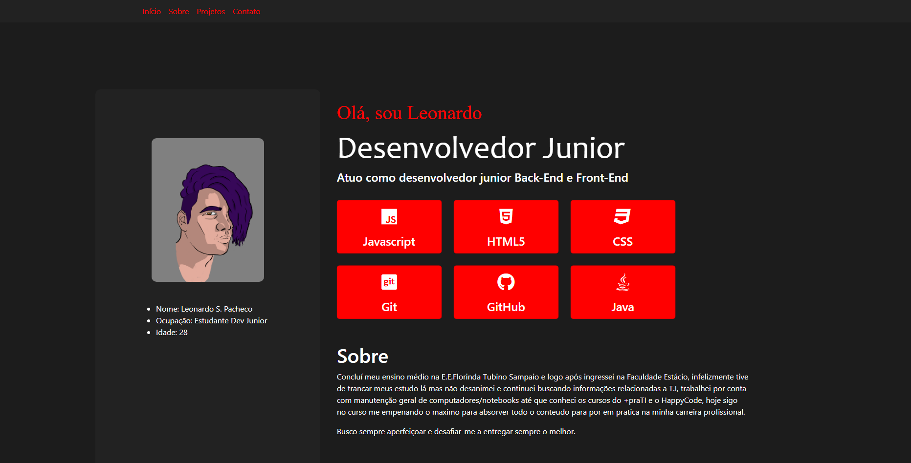

## Projeto Final Happy Code

> Formação a Introdução ao Desenvolvimento Front End

Projeto construido durante o curso ofertado pelo Happy Code em pareceria com o <a href="https://www.maisprati.com.br/" target="_blank">+praTI</a>.

[🔗 Clique aqui para acessar](https://srleorn.github.io/HappyCode/)

## ⚙ Tecnologias

- HTML
- CSS
- JavaScript
- Bootstrap
- GIT e Github

## 📧 Contato

leonardosouzapacheco@gmail.com
